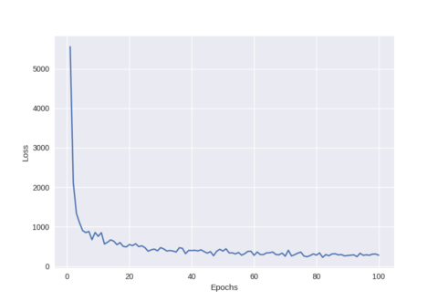
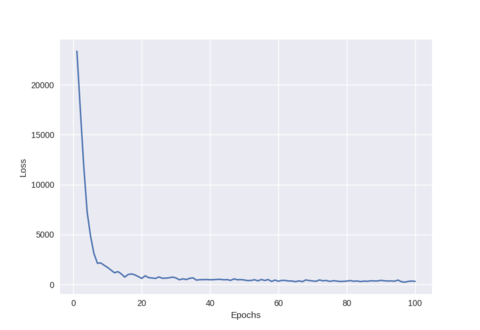

# MiniFlow
This is a minimal computational graph library built completely from scratch. This library is just like a mini version of tensorflow.
### Architecture
It uses a python class `Node`. This Node will calculate a value which represents it output.
```python
class Node:
	def __init__(self, inbound_nodes=[]):
		#nodes from which this node recieves values
		self.inbound_nodes = inbound_nodes
		#node to which this node passes values
		self.outbound_nodes = []

		self.value = None

		self.gradients = {}

		#Adding this node as an outbound node for each of its inbound node
		for n in inbound_nodes:
			n.outbound_nodes.append(self)

	def forward(self):

		raise NotImplementedError

	def backward(self):

		raise NotImplementedError
    
```
As of now this library has:
* Placeholders
* Sigmoid activation function
* Mean Squared Error loss function
* Cross Entropy loss function
* Stochastic Gradient descent optimization algorithm
* RMSProp optimization algorithm


#### We can clearly see the difference between SGD and RMSProp here
##### SGD

##### RMSProp 



### Graph
The `topological_graph` function creates a graph of neural networks by implementing [Topological sorting](https://en.wikipedia.org/wiki/Topological_sorting) using [Kanh's algorithm](https://en.wikipedia.org/wiki/Topological_sorting#Kahn.27s_algorithm).
